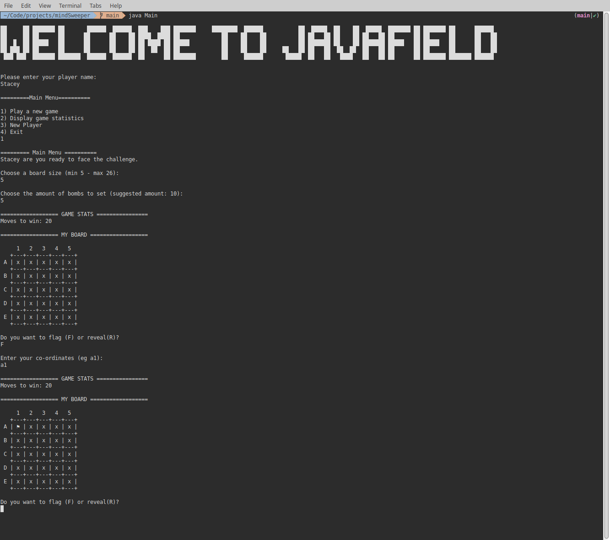
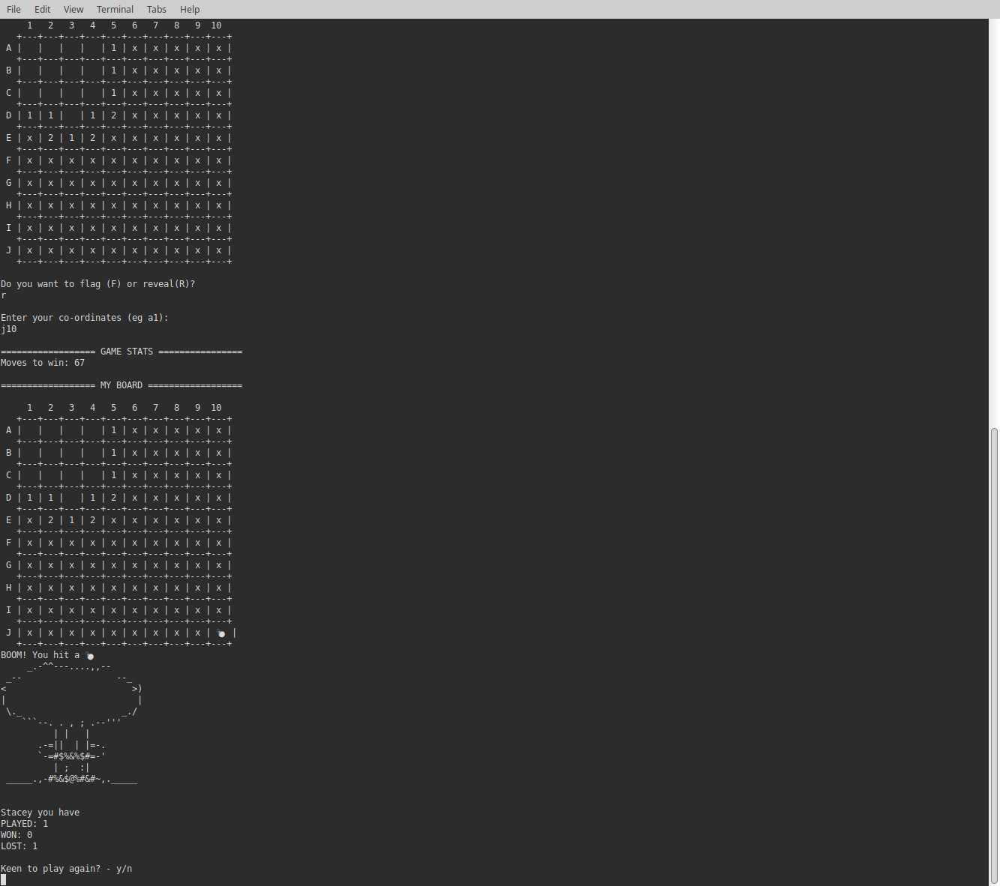

# Welcome to Java Minefield

Welcome to Java Minefield, a classic Minesweeper game powered by Java and played in the command-line interface (CLI).

Video of game play if you don't fancy don't fancying cloning this repo: 

## Build Steps

1. Clone the repo
2. Navigate into the cloned rep directory on your local machine
3. Run via `java Main` in the CLI
4. Enjoy

Please note you need to have JDK installed on your local machine in order for this game to work.

## Key Features

1. **User Customization**: Players can choose the board grid size and number of bombs.
2. **Interactive Menu**: Players can navigate options like changing their player name, viewing statistics, and starting a new game.

## Key Learning Highlights

1. **Object-Oriented Programming (OOP)**: Designed with classes to uphold OOP principles like encapsulation and abstraction.
2. **Java Fundamentals**: Solid grasp of Java basics to develop a robust and interactive game.

## Challenges

1. **Type Safety**: Understanding and leveraging Java's type system effectively.
2. **Dynamic Bomb Count Updates**: Implementing dynamic updates to surrounding bomb counts using a vector approach.

## Changelog

Date: 03/06/24

Updates:

**Class refinement:**

- Refactored the `Game` and `Board` classes to ensure separation of concerns and better abstraction, facilitating the future introduction of a GUI.
- Continued work on the `Game` class to ensure abstraction of user input is compatible with both CLI and GUI interfaces.

**Cascading feature:**

- Reworked the cascading logic to correctly display the number of moves to win and the adjacent bomb count.

**Visuals:**

- Introduced end-of-game word art graphics.
- Modified the board layout to improve visibility of adjacent bomb counts.

## To-Dos

1. **Player Statistics Storage**: Implement player stats storage using JSON files.
2. **GUI for Gameplay**: Develop a front-end web-based application to enhance the game beyond the CLI.

## Screenshots

| Menu Page                                 | Product Page                           |
| ----------------------------------------- | -------------------------------------- |
|   |  |

## Technologies Used

